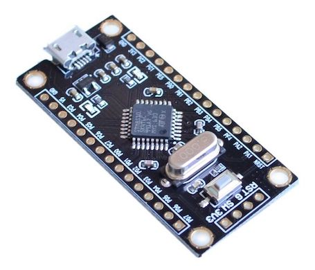

Firmware for STM8S105K4 boards
==============================

Dependencies
------------

+ cmake
+ sdcc
+ stm8flash

You will need an ST-LINK programmer to flash firmware onto this board.

Firmware list
-------------

* [LXYRC Skid Steer Loader](doc/lxyrc.md)
* [Active low signal passthrough](doc/passthru.md)
